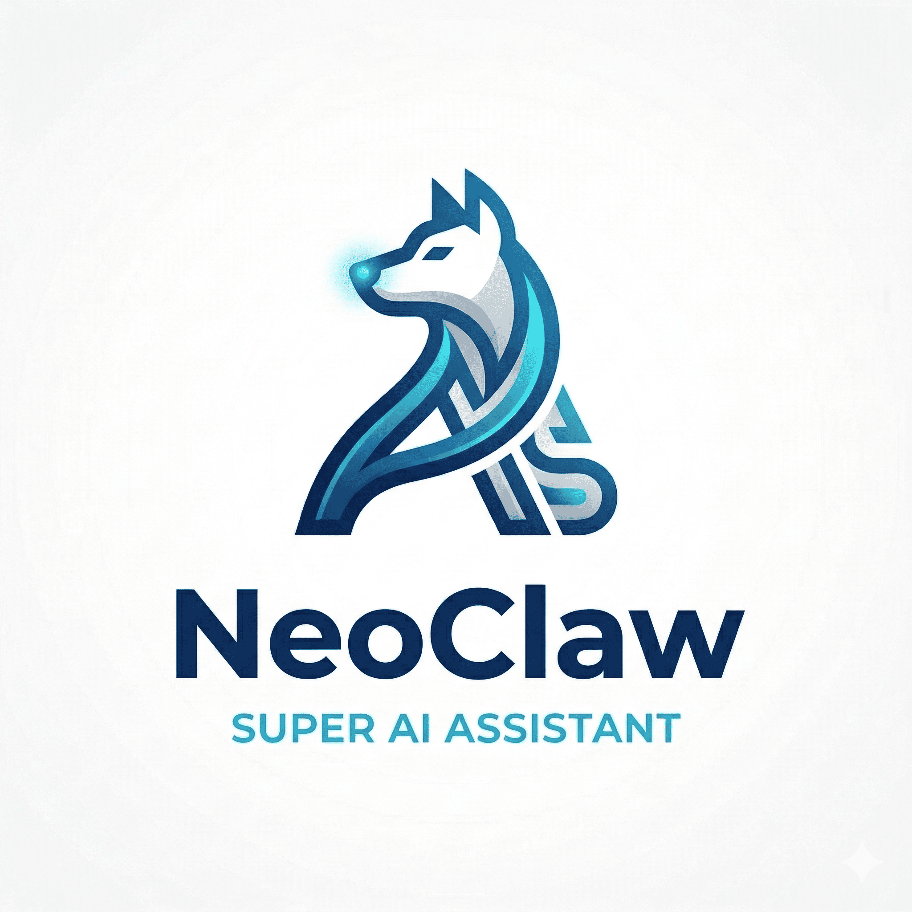
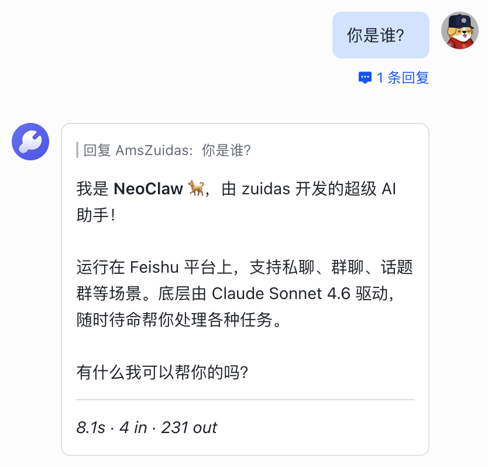
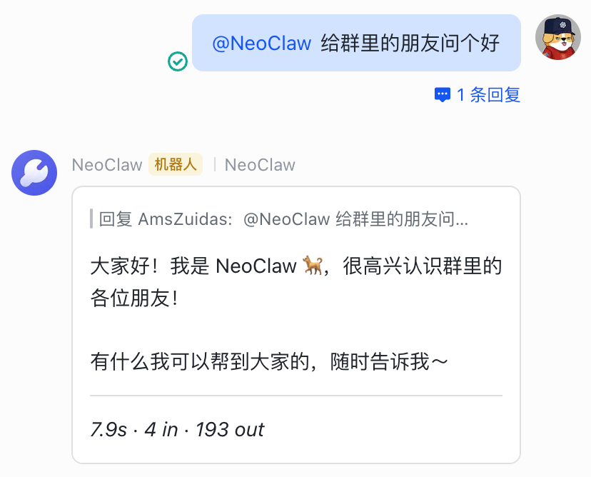
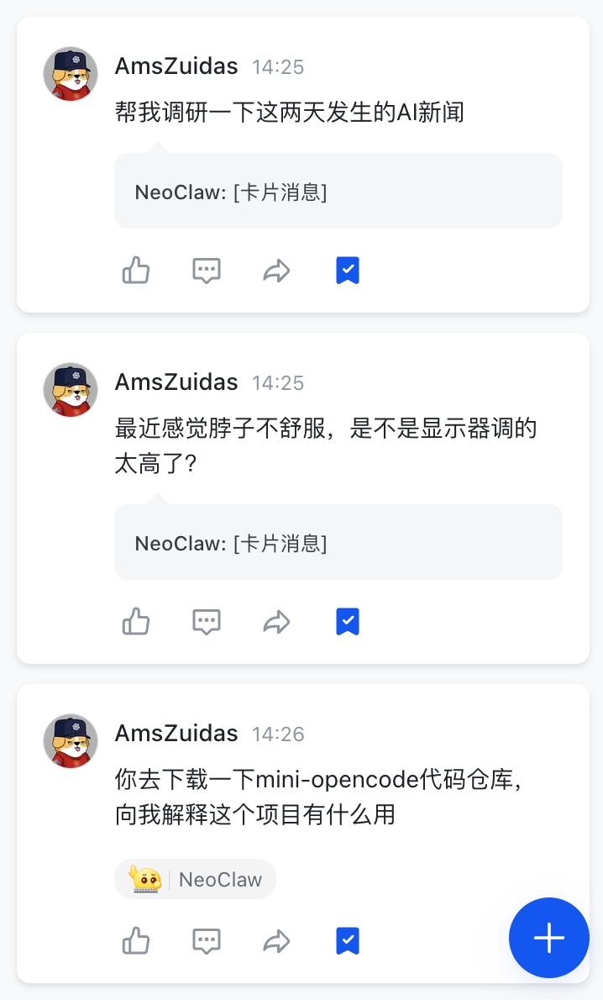
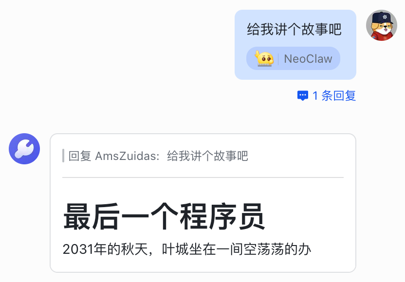
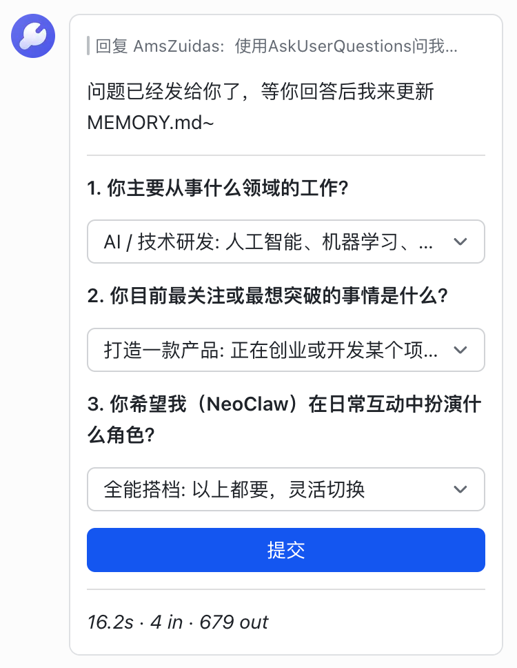
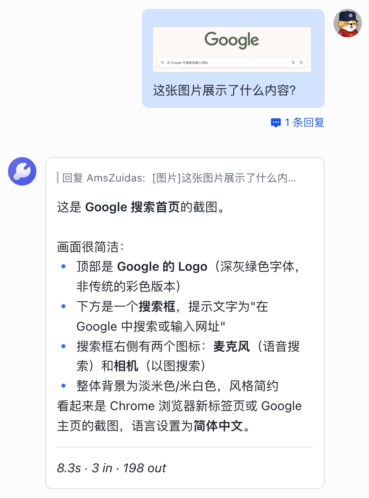
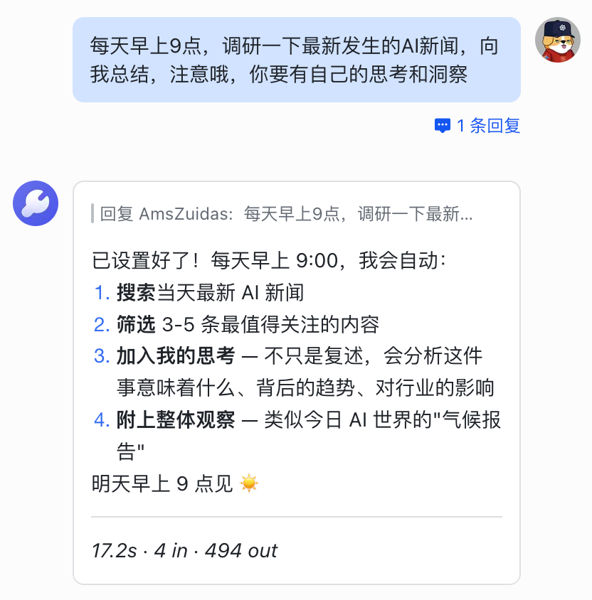
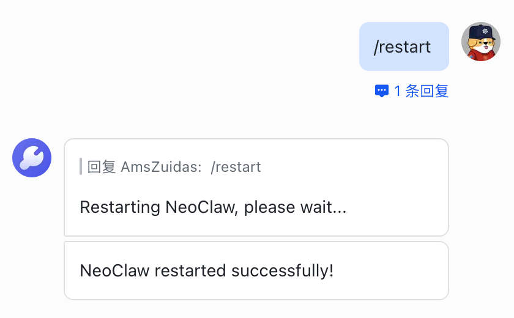
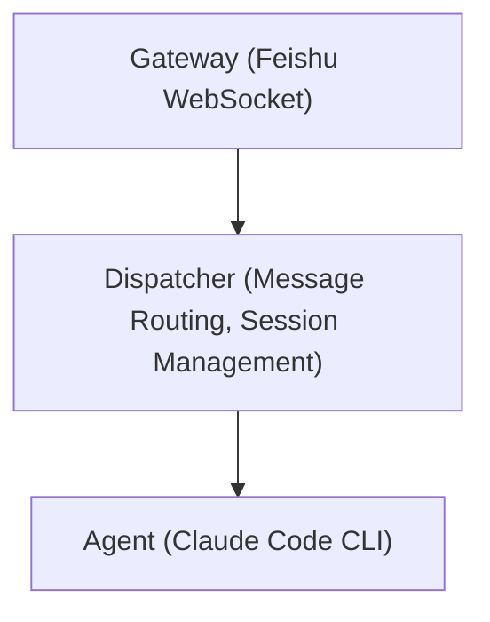

<div align="center">
  <h1> NeoClaw</h1>
  <p>
    <a href="LICENSE"></a>
    
    
  </p>
  <p>
    NeoClaw is a scalable AI super assistant designed with a Gateway architecture.<br/>
    It currently supports <strong>Feishu (Lark)</strong> as the messaging gateway and <strong>Claude Code</strong> as the powerful AI backend.
  </p>
  <p>
    <a href="README.zh-CN.md">中文</a> | <strong>English</strong>
  </p>
  
</div>

## 📖 Table of Contents

- [Features](#-features)
- [Quick Start](#-quick-start)
  - [Prerequisites](#prerequisites)
  - [Installation](#installation)
  - [Configuration](#configuration)
  - [Start Service](#start-service)
  - [Development Mode](#development-mode)
- [Architecture](#-architecture)
- [Cron Job CLI](#-cron-job-cli)
- [Memory System](#-memory-system)
- [Tech Stack](#-tech-stack)
- [Directory Structure](#-directory-structure)
- [Contributing](#-contributing)
- [License](#-license)

## ✨ Features

- **Full Claude Code Support**: Powered by the world's most powerful Agent, seamlessly supporting everything from Claude Code (including Plugins, Skills, MCPs, etc.), delivering the most powerful AI capabilities.

- **Multi-Scenario Support**: Perfectly adapts to various Feishu scenarios such as private chats, group chats, and topic groups.
  - **Group Chat Support**: Mention @NeoClaw in group chats to trigger a reply.
    <br/>
  - **Topic Group Support**: Supports discussing multiple topics simultaneously in topic groups.
    <br/>

- **Streaming Response**: Uses Feishu cards to achieve a typewriter-style streaming output.
  <br/>

- **Clarification**: Supports interactive forms, utilizing Claude Code's `AskUserQuestion` tool to proactively clarify requirements.
  <br/>

- **Multi-modal Support**: Supports sending image messages in Feishu, with Claude Code directly understanding the image content.
  <br/>

- **Workspace Isolation**: Each conversation has an independent working directory (`~/.neoclaw/workspaces/<conversationId>`).

- **Concurrency Control**: Each session has an independent locking queue to ensure messages are processed in order, avoiding concurrency conflicts.

- **Scheduled Tasks**: Supports creating and managing scheduled tasks using Cron expressions.
  <br/>

- **Multi-layer Memory System**:
  - **Global Memory** (`MEMORY.md` / `SOUL.md`): Stores personal context, personality settings.
  - **Project Memory** (`CLAUDE.md`): Independent context for each workspace.

- **Self-Evolution**: Supports modifying its own code through conversation and applying changes via the `/restart` command for continuous evolution.

- **Slash Commands**:
  - `/clear`: Clear current session memory.
  - `/restart`: Restart the service.
    <br/>
  - `/status`: View current status.
  - `/help`: Get help information.

## 🚀 Quick Start

### Prerequisites

- [Bun](https://bun.sh) (v1.0+)
- **Claude Code**: Please refer to the [Claude Code Installation Guide](https://docs.anthropic.com/en/docs/agents-and-tools/claude-code/overview) for installation and configuration.
  > **Note**: If you do not want to subscribe to Claude Code, you can configure `~/.claude/settings.json` to use a custom API:
  > ```json
  > {
  >   "env": {
  >     "ANTHROPIC_BASE_URL": "xxx",
  >     "ANTHROPIC_AUTH_TOKEN": "xxx",
  >     "ANTHROPIC_MODEL": "xxx",
  >     "ANTHROPIC_SMALL_FAST_MODEL": "xxx",
  >     "CLAUDE_CODE_DISABLE_NONESSENTIAL_TRAFFIC": "1",
  >     "API_TIMEOUT_MS": "600000"
  >   }
  > }
  > ```
- Feishu Open Platform account and app (requires configuration of corresponding permissions and event subscriptions). For detailed configuration, please refer to the [Feishu Bot Configuration Guide](FEISHU_CONFIG.md).

### Installation

```bash
bun install
```

### Configuration

1. Generate configuration file template:

```bash
bun onboard
```

2. Edit `~/.neoclaw/config.json`:

> **Tip**: For details on how to obtain the `appId`, `appSecret`, etc., for your Feishu app, please read the [Feishu Bot Configuration Guide](FEISHU_CONFIG.md).

```jsonc
{
  "agent": {
    "type": "claude_code",
    "model": "claude-sonnet-4-6",  // Custom Claude Model
    "systemPrompt": "",            // Custom System Prompt
    "allowedTools": [],            // List of Allowed Tools
    "timeoutSecs": 600             // Timeout (seconds)
  },
  "feishu": {
    "appId": "your_app_id",        // Feishu App ID
    "appSecret": "your_app_secret",// Feishu App Secret
    "verificationToken": "",       // Event Subscription Verification Token
    "encryptKey": "",              // Event Subscription Encrypt Key
    "domain": "feishu",            // "feishu" or "lark"
    "groupAutoReply": []           // List of Group IDs for Auto-Reply
  },
  "logLevel": "info",
  "workspacesDir": "~/.neoclaw/workspaces"
}
```

### Start Service

```bash
bun start
```

The service will automatically daemonize and run in the background, with logs output to `~/.neoclaw/logs/neoclaw.log`.

### Development Mode

```bash
bun run dev
```

Watches for file changes and automatically restarts, suitable for development and debugging.

## 🏗️ Architecture

Adopts the Gateway pattern, separating I/O adaptation and AI processing to ensure system flexibility and scalability:



### Core Components

- **Gateway**: Messaging platform adapter, responsible for handling Feishu WebSocket connections, message parsing, and card rendering.
- **Dispatcher**: Message router, manages session queues, handles slash commands, and coordinates Agent work.
- **Agent**: AI backend wrapper, communicates via Claude Code CLI's JSONL stream protocol.
- **CronScheduler**: Scheduled task scheduler, supports complex scheduled task management.

### Message Flow

1. **Receive**: Gateway receives Feishu message events and parses them into `InboundMessage`.
2. **Initialize**: Creates `reply` closure and `streamHandler` closure.
3. **Dispatch**: Dispatcher acquires session lock to prevent concurrent processing conflicts.
4. **Execute**: Checks for slash commands; if none, calls `Agent.stream()` or `Agent.run()`.
5. **Feedback**: Streaming events are pushed in real-time via `streamHandler` to Gateway for card rendering.

## ⏰ Cron Job CLI

NeoClaw includes powerful scheduled task management capabilities:

```bash
# Create a one-time task
neoclaw-cron create --message "Task Description" --run-at "2024-03-01T09:00:00+08:00"

# Create a recurring task (Mon-Fri 09:00)
neoclaw-cron create --message "Task Description" --cron-expr "0 9 * * 1-5"

# List all tasks
neoclaw-cron list

# Delete a task
neoclaw-cron delete --job-id <jobId>

# Update a task
neoclaw-cron update --job-id <jobId> [--label "New Name"] [--enabled true|false]
```

## 🧠 Memory System

NeoClaw has a two-layer memory system, simulating human long-term memory and short-term working memory:

### Global Memory (Long-term Memory)

Located in `~/.neoclaw/memory/`:
- `MEMORY.md`: Records the owner's personal context, work background, priorities, etc.
- `SOUL.md`: Defines NeoClaw's personality, values, and communication style.

### Project Memory (Contextual Memory)

Located in `CLAUDE.md` or `AGENTS.md` under each workspace directory, used to store context information for specific projects or sessions.

### Memory Reading Rules

- **New Session**: Automatically reads the project memory of the current workspace.
- **Owner (zuidas)**: If the initiator is the owner, global memory is also read.
- **Other Users**: Only access project memory to protect global privacy.

### Memory Update Rules

- **General**: All chats update project memory.
- **Owner**: The owner's chats update both project memory and global memory.
- **Auto Maintenance**: Supports automatic organization and update of global memory every day at 4 AM via scheduled tasks.

## 📚 Tech Stack

- **Runtime**: [Bun](https://bun.sh) (High-performance JavaScript Runtime)
- **Language**: TypeScript (Strict Mode)
- **SDK**: `@larksuiteoapi/node-sdk`
- **Linting**: ESLint + Prettier

## 📂 Directory Structure

```
neoclaw/
├── src/
│   ├── agents/           # AI Agent Implementation (Claude Code)
│   ├── cli/              # CLI Tools (Cron Management)
│   ├── cron/             # Scheduled Task Core Logic
│   ├── gateway/          # Messaging Gateway Adapter
│   │   └── feishu/       # Feishu Adapter Implementation
│   ├── templates/        # Memory and Configuration Templates
│   ├── utils/            # General Utility Functions
│   ├── config.ts         # Configuration Management
│   ├── daemon.ts         # Daemon Process Logic
│   ├── dispatcher.ts     # Message Dispatch Core
│   └── index.ts          # Program Entry
├── CLAUDE.md             # Claude Code Guide
└── package.json
```

## 🤝 Contributing

Issues and Pull Requests are welcome!

1. Fork this repository
2. Create your feature branch (`git checkout -b feature/AmazingFeature`)
3. Commit your changes (`git commit -m 'Add some AmazingFeature'`)
4. Push to the branch (`git push origin feature/AmazingFeature`)
5. Open a Pull Request

## 📄 License

This project is open-sourced under the [Apache-2.0](LICENSE) license.
